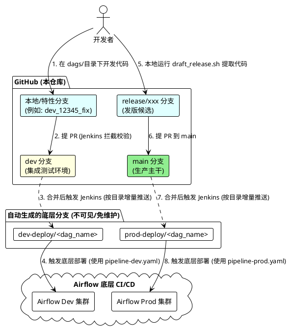

# Airflow DAG 开发与发版规范 (Monorepo)

本项目采用 **“Monorepo + 自动分发”** 的模式。大家都在 `dev` 和 `main` 主干上基于目录进行开发，由 Jenkins 自动将每个目录拆分推送到对应的底层环境分支，从而触发实际的 Airflow 部署。

---

## 🏗️ 架构与流程图 (PlantUML)

以下是代码从开发到上线的完整流转机制：



---

## 🔒 核心拦截机制：GitHub 分支保护与 Jenkins 状态检查联动设置

为了确保团队严格遵守规范，我们强制要求 **“必须通过 Jenkins 校验 (Status Check为 true) 才能点击 Merge 合并按钮”**。

### 🔧 配置前置条件
1. Jenkins 必须配置了 **GitHub Branch Source** 插件（多分支流水线）。
2. 在 Jenkins 成功运行过至少一次 PR 构建（让 GitHub 记录下 Jenkins 回传的状态标识，默认通常为 `continuous-integration/jenkins/pr-merge` 或类似名称）。

### 🛠️ GitHub 可视化配置步骤 (管理员操作)
1. 进入本代码仓库的 GitHub 页面，点击顶部导航栏的 **Settings (设置)**。
2. 左侧菜单栏选择 **Branches (分支)**。
3. 在 **Branch protection rules (分支保护规则)** 区域，点击 **Add rule (添加规则)**。
4. **Branch name pattern (分支名称模式)**：输入 `dev`。
5. **开启核心拦截**：向下滚动并勾选 ✅ **Require status checks to pass before merging** (要求状态检查通过后才能合并)。
6. **选择 Jenkins 检查项**：勾选后会出现搜索框，在框中搜索 `jenkins/pr-merge`（或你 Jenkins 实际上报的 Context Name），并勾选该项。
7. **防止代码落后**：强烈建议同时勾选 ✅ **Require branches to be up to date before merging**，强制开发者合并前处理冲突。
8. 同样为 `main` 分支添加一条保护规则。
9. 点击底部 **Save changes (保存更改)**。

配置完成后，所有提往 `dev` 或 `main` 的 PR 都会被自动锁定，直到 Jenkins 回传 ✅ Success 后，Merge 按钮才会变绿。

---

## 🛠️ 核心研发流指南

### 1. 开发规范 (Dev)
- **永远基于 dev 切分支:** 必须使用 `dev_员工号_功能描述` 的格式（如 `dev_001_add_sensor`），否则 PR 会被 Jenkins 流水线直接拦截，抛出错误。
- **防止主干污染:** 绝对禁止将 `main` 的代码直接 PR 回 `dev`。
- **全局唯一性:** 每个 DAG 目录下的 `pom.xml` 中 `artifactId` 必须唯一，Jenkins 会在 PR 阶段执行全库扫描。

### 2. 发布规范 (Prod)
由于 `dev` 中包含大量测试中代码，禁止直接执行 Git Merge 将 `dev -> main`。请使用项目中提供的自动化脚本来精准发版：

```bash
# 执行发布脚本并指定你要发布的 DAG 目录名
bash scripts/draft_release.sh <你的DAG目录名>

# 示例:我想发布 user_behavior_dag
bash scripts/draft_release.sh user_behavior_dag
```
脚本会自动从 `dev` 中把你测试通过的 DAG 代码抽离出来，创建一个干净的 `release` 分支，推送到 GitHub 后你只需要提 PR 到 `main` 即可。
