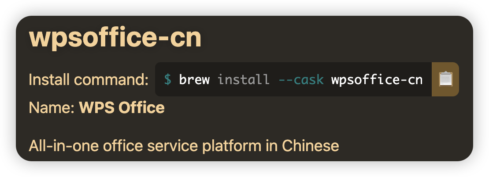

# Mac

!!! tip
    Mac 手成本高 但是带来的体验是非常棒的 除非找不到你想要的软件

## Homebrew

- 安装 xcode 命令行工具

  ```zsh
  xcode-select --install
  ```

- 安装脚本 ( [国内源](https://gitee.com/cunkai/HomebrewCN) )

  ```zsh
  /bin/zsh -c "(curl -fsSL https://gitee.com/cunkai/HomebrewCN/raw/master/Homebrew.sh)"
  ```

- 卸载脚本 ( [国内源](https://gitee.com/cunkai/HomebrewCN) )

  ```zsh
  /bin/zsh -c "(curl -fsSL https://gitee.com/cunkai/HomebrewCN/raw/master/HomebrewUninstall.sh)"
  ```

- 安装软件
  - 请在 [Homebrew Formulae](https://formulae.brew.sh/) 搜索软件
    
  - 执行安装命令
    

    ```zsh
    brew install --cask wpsoffice-cn
    ```

- 卸载软件
  - 执行卸载命令

    ```zsh
    brew uninstall --cask wpsoffice-cn
    ```

## 装机必备

- ### 系统工具

    | 软件 | 描述  | 官网地址 | 下载渠道 |
    | :--- | :---- | :------- | :------- |
    | xxxx | xxxxx | xxxxx    |          |
